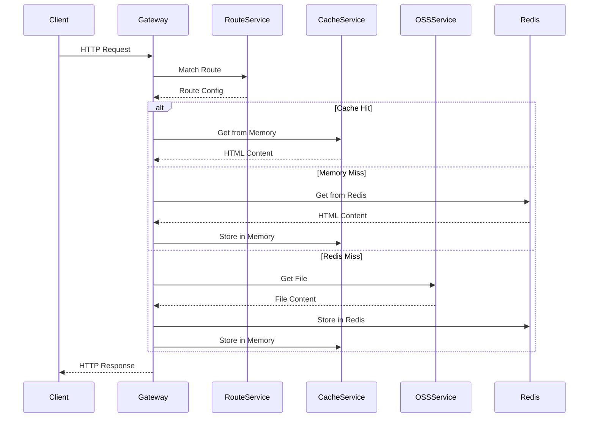
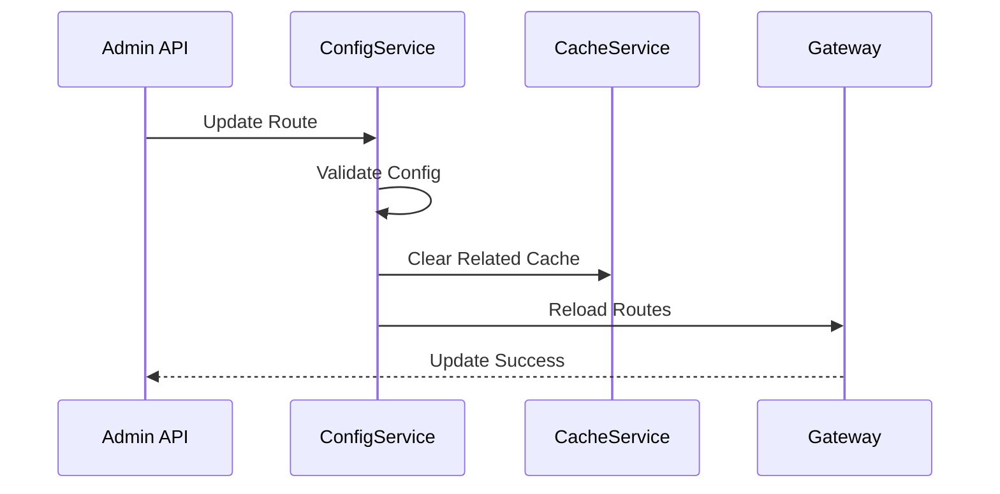

# feRouter Gateway - 基于Node.js的路由网关系统

## 🎯 项目概述

feRouter Gateway 是一个基于 Nest.js 构建的高性能路由网关系统，主要功能是通过不同的路由返回对应的 OSS 静态 HTML 文件，支持动态路由配置、缓存机制、负载均衡等企业级功能。

## 🏗️ 技术架构

### 核心技术栈

- **框架**: Nest.js v10+ (企业级Node.js框架)
- **语言**: TypeScript 5.3+
- **存储**: 阿里云 OSS (对象存储服务)
- **缓存**: Redis (高性能缓存)
- **文档**: Swagger/OpenAPI 3.0
- **监控**: 内置健康检查和指标监控

### 架构特点

- **微服务架构**: 模块化设计，易于扩展和维护
- **高性能**: 基于 Fastify 内核，支持高并发请求
- **智能缓存**: 多级缓存策略，减少OSS访问次数
- **动态配置**: 支持热更新路由配置，无需重启服务
- **容错机制**: 完善的错误处理和降级策略

## 📁 项目结构

```
apps/gateway/
├── src/
│   ├── main.ts                 # 应用入口
│   ├── app.module.ts           # 根模块
│   ├── common/                 # 公共模块
│   │   ├── decorators/         # 自定义装饰器
│   │   ├── filters/            # 全局异常过滤器
│   │   ├── guards/             # 权限守卫
│   │   ├── interceptors/       # 响应拦截器
│   │   └── pipes/              # 数据验证管道
│   ├── config/                 # 配置管理
│   │   ├── app.config.ts       # 应用基础配置
│   │   ├── oss.config.ts       # OSS存储配置
│   │   └── redis.config.ts     # Redis缓存配置
│   ├── modules/
│   │   ├── gateway/            # 网关核心模块
│   │   │   ├── gateway.controller.ts
│   │   │   ├── gateway.service.ts
│   │   │   ├── gateway.module.ts
│   │   │   └── dto/            # 数据传输对象
│   │   ├── oss/                # OSS服务模块
│   │   │   ├── oss.service.ts
│   │   │   ├── oss.module.ts
│   │   │   └── interfaces/
│   │   ├── cache/              # 缓存服务模块
│   │   │   ├── cache.service.ts
│   │   │   ├── cache.module.ts
│   │   │   └── strategies/
│   │   └── routes/             # 路由配置模块
│   │       ├── routes.service.ts
│   │       ├── routes.module.ts
│   │       └── entities/
│   ├── types/                  # TypeScript类型定义
│   └── utils/                  # 通用工具函数
├── docs/                       # 详细文档
│   ├── architecture.md         # 架构设计文档
│   ├── api.md                  # API接口文档
│   ├── deployment.md           # 部署指南
│   └── configuration.md        # 配置说明
├── config/                     # 配置文件
│   ├── routes.json             # 路由配置
│   ├── .env.example            # 环境变量示例
│   └── docker-compose.yml      # Docker编排
├── package.json
├── tsconfig.json
├── nest-cli.json
└── Dockerfile
```

## 🚀 核心功能

### 1. 智能路由匹配

- **路径匹配**: 支持精确匹配、通配符匹配、正则表达式匹配
- **域名绑定**: 支持多域名、子域名路由分发
- **条件路由**: 基于User-Agent、IP、请求头等条件的智能路由

### 2. OSS集成

- **多存储桶支持**: 支持配置多个OSS存储桶
- **文件缓存**: 智能缓存策略，减少OSS访问成本
- **CDN加速**: 支持OSS CDN加速域名

### 3. 高性能缓存

- **多级缓存**: 内存缓存 + Redis分布式缓存
- **智能失效**: 基于文件更新时间的自动缓存失效
- **预热机制**: 支持缓存预热和批量更新

### 4. 监控运维

- **健康检查**: /health 端点监控服务状态
- **性能指标**: 响应时间、成功率、缓存命中率等
- **日志追踪**: 结构化日志，支持链路追踪

## 🛠️ 快速开始

### 环境要求

- Node.js 18+
- Redis 6+
- pnpm 8+

### 安装依赖

```bash
cd apps/gateway
pnpm install
```

### 配置环境变量

```bash
cp config/.env.example .env
# 编辑 .env 文件配置OSS和Redis连接信息
```

### 启动开发服务

```bash
pnpm dev
```

### 访问文档

- API文档: http://localhost:3000/api
- 健康检查: http://localhost:3000/health

## 📝 配置说明

### 路由配置示例

```json
{
  "routes": [
    {
      "path": "/home",
      "ossPath": "pages/home/index.html",
      "bucket": "static-web",
      "cacheTime": 600,
      "enabled": true,
      "headers": {
        "X-Page-Type": "home",
        "Cache-Control": "public, max-age=3600"
      }
    },
    {
      "path": "/docs/*",
      "ossPath": "docs/index.html",
      "bucket": "documentation",
      "domain": "docs.example.com",
      "cacheTime": 300,
      "enabled": true
    }
  ]
}
```

### OSS配置

```typescript
{
  oss: {
    region: 'oss-cn-hangzhou',
    accessKeyId: 'your_access_key',
    accessKeySecret: 'your_secret_key',
    buckets: {
      'static-web': {
        bucket: 'my-static-bucket',
        endpoint: 'https://my-static-bucket.oss-cn-hangzhou.aliyuncs.com'
      }
    }
  }
}
```

## 🔧 部署指南

### Docker部署

```bash
# 构建镜像
docker build -t fe-router-gateway .

# 运行容器
docker run -d \
  --name gateway \
  -p 3000:3000 \
  --env-file .env \
  fe-router-gateway
```

### Docker Compose

```bash
docker-compose up -d
```

## 📊 性能指标

- **并发处理**: 支持10,000+ QPS
- **响应时间**: 平均 < 50ms (缓存命中)
- **内存占用**: < 512MB (生产环境)
- **缓存命中率**: > 85% (正常业务场景)

## 🤝 贡献指南

1. Fork 项目
2. 创建功能分支 (`git checkout -b feature/AmazingFeature`)
3. 提交更改 (`git commit -m 'Add some AmazingFeature'`)
4. 推送分支 (`git push origin feature/AmazingFeature`)
5. 创建 Pull Request

## 📄 许可证

本项目采用 MIT 许可证 - 查看 [LICENSE](LICENSE) 文件了解详情。

## 📞 联系我们

- 项目维护者: [Your Name]
- 邮箱: your.email@example.com
- 问题反馈: [GitHub Issues](https://github.com/your-org/feRouter/issues)

````

现在创建架构设计文档：

```markdown:apps/gateway/docs/architecture.md
# feRouter Gateway 架构设计文档

## 1. 系统架构概览

### 1.1 整体架构图

```mermaid
graph TB
    Client[客户端请求] --> LB[负载均衡器]
    LB --> Gateway[Gateway实例1]
    LB --> Gateway2[Gateway实例2]
    LB --> Gateway3[Gateway实例N]

    Gateway --> RouteMatch{路由匹配}
    RouteMatch --> Cache{缓存检查}
    Cache --> |命中| ReturnHTML[返回HTML]
    Cache --> |未命中| OSS[阿里云OSS]
    OSS --> CacheStore[存储缓存]
    CacheStore --> ReturnHTML

    Gateway --> Redis[(Redis缓存)]
    Gateway --> Config[配置中心]

    subgraph "监控体系"
        Metrics[性能指标]
        Logs[日志系统]
        Health[健康检查]
    end
````

### 1.2 技术选型

| 组件     | 技术选择       | 理由                                       |
| -------- | -------------- | ------------------------------------------ |
| Web框架  | Nest.js        | 企业级架构、TypeScript原生支持、模块化设计 |
| HTTP引擎 | Fastify        | 高性能、低延迟、内存占用小                 |
| 缓存     | Redis          | 高性能、支持分布式、丰富的数据结构         |
| 存储     | 阿里云OSS      | 高可用、低成本、CDN加速                    |
| 配置管理 | @nestjs/config | 环境变量管理、类型安全                     |
| 文档     | Swagger        | 自动生成API文档、交互式测试                |

## 2. 核心模块设计

### 2.1 Gateway Controller (网关控制器)

```typescript
@Controller()
export class GatewayController {
  // 主要职责：
  // 1. 接收所有HTTP请求
  // 2. 路由匹配和分发
  // 3. 响应组装和返回
  // 4. 错误处理
}
```

**设计要点：**

- 使用通配符路由 `@Get('*')` 捕获所有请求
- 实现智能路由匹配算法
- 支持多种匹配策略（精确、通配符、正则）
- 统一错误处理和响应格式

### 2.2 Routes Service (路由服务)

```typescript
export interface RouteConfig {
  id: string; // 路由唯一标识
  path: string; // 匹配路径
  method?: HttpMethod[]; // HTTP方法限制
  ossPath: string; // OSS文件路径
  bucket: string; // OSS存储桶
  priority: number; // 路由优先级
  conditions?: RouteCondition[]; // 匹配条件
  cacheConfig?: CacheConfig; // 缓存配置
  headers?: Record<string, string>; // 响应头
  enabled: boolean; // 是否启用
  createdAt: Date;
  updatedAt: Date;
}
```

**路由匹配算法：**

1. **优先级排序**: 按 priority 字段降序排列
2. **精确匹配**: 完全匹配的路径优先
3. **通配符匹配**: 支持 `*` 和 `**` 通配符
4. **正则匹配**: 支持正则表达式路径
5. **条件过滤**: 检查域名、User-Agent等条件

### 2.3 OSS Service (对象存储服务)

```typescript
@Injectable()
export class OssService {
  private clients: Map<string, OSS>;

  // 核心方法：
  async getFileContent(bucket: string, filePath: string): Promise<string>;
  async getFileStream(bucket: string, filePath: string): Promise<Readable>;
  async fileExists(bucket: string, filePath: string): Promise<boolean>;
  async getFileMetadata(
    bucket: string,
    filePath: string
  ): Promise<FileMetadata>;
}
```

**功能特性：**

- **多存储桶管理**: 支持配置多个OSS实例
- **连接池**: 复用OSS客户端连接
- **错误重试**: 网络异常时自动重试
- **流式传输**: 大文件流式读取，减少内存占用
- **元数据缓存**: 缓存文件信息，减少API调用

### 2.4 Cache Service (缓存服务)

```typescript
export interface CacheStrategy {
  // L1: 内存缓存 (Node.js Map)
  memory: {
    maxSize: number; // 最大条目数
    ttl: number; // 生存时间
  };

  // L2: Redis分布式缓存
  redis: {
    ttl: number; // 生存时间
    keyPrefix: string; // 键前缀
  };
}
```

**缓存策略：**

1. **读取流程**: 内存缓存 → Redis缓存 → OSS原文件
2. **写入流程**: 同时写入内存和Redis
3. **失效策略**: TTL过期 + 手动清除
4. **预热机制**: 启动时预加载热点数据

## 3. 数据流设计

### 3.1 请求处理流程



### 3.2 配置更新流程



## 4. 缓存架构

### 4.1 多级缓存设计

```typescript
class CacheManager {
  // L1: 内存缓存 (最快)
  private memoryCache: Map<string, CacheItem> = new Map();

  // L2: Redis缓存 (分布式)
  private redisCache: Redis;

  // L3: OSS存储 (持久化)
  private ossService: OssService;
}
```

**缓存层级：**

- **L1 Memory**: 响应时间 < 1ms，容量限制 100MB
- **L2 Redis**: 响应时间 < 10ms，容量限制 10GB
- **L3 OSS**: 响应时间 < 100ms，无容量限制

### 4.2 缓存键设计

```typescript
// 缓存键格式
const cacheKey = `gateway:${version}:${path}:${domain}:${hash}`;

// 示例
('gateway:v1:/home:www.example.com:abc123');
('gateway:v1:/docs/api:docs.example.com:def456');
```

### 4.3 缓存更新策略

1. **被动更新**: TTL过期后重新获取
2. **主动更新**: 配置变更时清除相关缓存
3. **预热更新**: 定时任务预加载热点数据
4. **版本控制**: 配置版本变更时全量清除

## 5. 错误处理机制

### 5.1 错误分类

```typescript
enum ErrorType {
  ROUTE_NOT_FOUND = 'ROUTE_NOT_FOUND', // 路由未找到
  OSS_FILE_NOT_FOUND = 'OSS_FILE_NOT_FOUND', // OSS文件不存在
  OSS_ACCESS_ERROR = 'OSS_ACCESS_ERROR', // OSS访问错误
  CACHE_ERROR = 'CACHE_ERROR', // 缓存服务错误
  CONFIG_ERROR = 'CONFIG_ERROR', // 配置错误
  INTERNAL_ERROR = 'INTERNAL_ERROR', // 内部错误
}
```

### 5.2 降级策略

```typescript
class FallbackStrategy {
  // 1. 缓存降级：Redis故障时使用内存缓存
  async cacheFailover(key: string): Promise<string>;

  // 2. OSS降级：主存储桶故障时使用备用存储桶
  async ossFailover(bucket: string, path: string): Promise<string>;

  // 3. 默认页面：所有服务故障时返回默认页面
  async defaultPage(): Promise<string>;
}
```

## 6. 监控和观测

### 6.1 性能指标

```typescript
interface Metrics {
  // 业务指标
  requestCount: number; // 请求总数
  responseTime: number[]; // 响应时间分布
  errorRate: number; // 错误率
  cacheHitRate: number; // 缓存命中率

  // 系统指标
  memoryUsage: number; // 内存使用率
  cpuUsage: number; // CPU使用率
  connectionCount: number; // 连接数

  // OSS指标
  ossRequestCount: number; // OSS请求次数
  ossErrorCount: number; // OSS错误次数
  ossBandwidth: number; // OSS带宽使用
}
```

### 6.2 健康检查

```typescript
@Get('/health')
async healthCheck(): Promise<HealthCheckResult> {
  return {
    status: 'ok',
    timestamp: new Date().toISOString(),
    uptime: process.uptime(),
    version: packageJson.version,
    checks: {
      redis: await this.checkRedis(),
      oss: await this.checkOSS(),
      memory: this.checkMemory(),
      routes: this.checkRoutes()
    }
  };
}
```

## 7. 扩展性设计

### 7.1 水平扩展

- **无状态设计**: Gateway实例间无状态共享
- **负载均衡**: 支持多实例部署
- **配置同步**: 通过Redis或配置中心同步

### 7.2 插件机制

```typescript
interface Plugin {
  name: string;
  version: string;

  // 请求前处理
  beforeRequest?(context: RequestContext): Promise<void>;

  // 响应后处理
  afterResponse?(context: ResponseContext): Promise<void>;

  // 错误处理
  onError?(error: Error, context: RequestContext): Promise<void>;
}
```

## 8. 安全性设计

### 8.1 访问控制

- **IP白名单**: 限制管理接口访问
- **API密钥**: 管理接口需要密钥认证
- **CORS配置**: 跨域请求控制

### 8.2 防护机制

- **限流**: 基于IP和路由的请求限流
- **防盗链**: OSS防盗链配置
- **XSS防护**: 响应头安全配置

```typescript
// 安全中间件配置
app.use(
  helmet({
    contentSecurityPolicy: {
      directives: {
        defaultSrc: ["'self'"],
        scriptSrc: ["'self'", "'unsafe-inline'"],
        styleSrc: ["'self'", "'unsafe-inline'"],
      },
    },
  })
);
```

这个架构设计确保了系统的高性能、高可用性和可扩展性，同时保持了代码的清晰性和可维护性。

````

继续创建API文档：

```markdown:apps/gateway/docs/api.md
# feRouter Gateway API 文档

## 概述

feRouter Gateway 提供了RESTful API接口用于管理路由配置、监控系统状态和查看统计信息。

## 基础信息

- **Base URL**: `http://localhost:3000`
- **API版本**: v1
- **认证方式**: API Key (管理接口)
- **内容类型**: `application/json`

## 公共接口

### 1. 健康检查

检查服务运行状态和各组件健康情况。

```http
GET /health
````

**响应示例:**

```json
{
  "status": "ok",
  "timestamp": "2024-01-15T10:30:00.000Z",
  "uptime": 3600.5,
  "version": "1.0.0",
  "checks": {
    "redis": {
      "status": "ok",
      "responseTime": 2
    },
    "oss": {
      "status": "ok",
      "responseTime": 45
    },
    "memory": {
      "status": "ok",
      "usage": "45%",
      "total": "512MB",
      "used": "230MB"
    },
    "routes": {
      "status": "ok",
      "total": 15,
      "enabled": 12,
      "disabled": 3
    }
  }
}
```

### 2. 系统信息

获取系统基本信息和版本详情。

```http
GET /info
```

**响应示例:**

```json
{
  "name": "feRouter Gateway",
  "version": "1.0.0",
  "environment": "production",
  "nodeVersion": "18.17.0",
  "platform": "linux",
  "architecture": "x64",
  "startTime": "2024-01-15T09:00:00.000Z",
  "timezone": "Asia/Shanghai"
}
```

## 管理接口

> 🔒 以下接口需要在请求头中携带 `X-API-Key` 进行认证

### 路由管理

#### 1. 获取路由列表

```http
GET /api/routes
```

**查询参数:**

- `page`: 页码 (默认: 1)
- `limit`: 每页数量 (默认: 20)
- `status`: 路由状态 (`enabled` | `disabled` | `all`)
- `search`: 搜索关键词

**响应示例:**

```json
{
  "data": [
    {
      "id": "route-001",
      "path": "/home",
      "method": ["GET"],
      "ossPath": "pages/home/index.html",
      "bucket": "static-web",
      "priority": 100,
      "cacheTime": 600,
      "enabled": true,
      "headers": {
        "X-Page-Type": "home"
      },
      "conditions": {
        "domain": "www.example.com"
      },
      "stats": {
        "requests": 1520,
        "cacheHits": 1380,
        "lastAccess": "2024-01-15T10:25:00.000Z"
      },
      "createdAt": "2024-01-10T10:00:00.000Z",
      "updatedAt": "2024-01-15T09:30:00.000Z"
    }
  ],
  "pagination": {
    "page": 1,
    "limit": 20,
    "total": 25,
    "pages": 2
  }
}
```

#### 2. 获取单个路由

```http
GET /api/routes/{id}
```

**路径参数:**

- `id`: 路由ID

**响应示例:**

```json
{
  "id": "route-001",
  "path": "/home",
  "method": ["GET"],
  "ossPath": "pages/home/index.html",
  "bucket": "static-web",
  "priority": 100,
  "cacheTime": 600,
  "enabled": true,
  "headers": {
    "X-Page-Type": "home",
    "Cache-Control": "public, max-age=3600"
  },
  "conditions": {
    "domain": "www.example.com",
    "userAgent": "!bot"
  },
  "fallback": {
    "bucket": "backup-web",
    "ossPath": "pages/maintenance.html"
  },
  "createdAt": "2024-01-10T10:00:00.000Z",
  "updatedAt": "2024-01-15T09:30:00.000Z"
}
```

#### 3. 创建路由

```http
POST /api/routes
```

**请求体:**

```json
{
  "path": "/about",
  "method": ["GET"],
  "ossPath": "pages/about/index.html",
  "bucket": "static-web",
  "priority": 90,
  "cacheTime": 300,
  "enabled": true,
  "headers": {
    "X-Page-Type": "about"
  },
  "conditions": {
    "domain": "www.example.com"
  }
}
```

**响应示例:**

```json
{
  "id": "route-002",
  "path": "/about",
  "method": ["GET"],
  "ossPath": "pages/about/index.html",
  "bucket": "static-web",
  "priority": 90,
  "cacheTime": 300,
  "enabled": true,
  "headers": {
    "X-Page-Type": "about"
  },
  "conditions": {
    "domain": "www.example.com"
  },
  "createdAt": "2024-01-15T10:30:00.000Z",
  "updatedAt": "2024-01-15T10:30:00.000Z"
}
```

#### 4. 更新路由

```http
PUT /api/routes/{id}
```

**路径参数:**

- `id`: 路由ID

**请求体:** (同创建路由)

#### 5. 删除路由

```http
DELETE /api/routes/{id}
```

**路径参数:**

- `id`: 路由ID

**响应:**

```json
{
  "message": "Route deleted successfully",
  "id": "route-002"
}
```

#### 6. 批量操作

```http
POST /api/routes/batch
```

**请求体:**

```json
{
  "action": "enable", // "enable" | "disable" | "delete"
  "ids": ["route-001", "route-002", "route-003"]
}
```

### 缓存管理

#### 1. 获取缓存统计

```http
GET /api/cache/stats
```

**响应示例:**

```json
{
  "memory": {
    "size": 1024,
    "maxSize": 10000,
    "hitRate": 0.85,
    "items": 256
  },
  "redis": {
    "size": "2.5MB",
    "hitRate": 0.78,
    "items": 1520,
    "connection": "connected"
  },
  "overall": {
    "hitRate": 0.82,
    "requests": 10000,
    "hits": 8200,
    "misses": 1800
  }
}
```

#### 2. 清除缓存

```http
DELETE /api/cache
```

**查询参数:**

- `pattern`: 缓存键模式 (可选)
- `level`: 缓存级别 (`memory` | `redis` | `all`, 默认: `all`)

**请求示例:**

```http
DELETE /api/cache?pattern=/home/*&level=all
```

**响应:**

```json
{
  "message": "Cache cleared successfully",
  "cleared": {
    "memory": 25,
    "redis": 120
  }
}
```

#### 3. 预热缓存

```http
POST /api/cache/warm
```

**请求体:**

```json
{
  "routes": ["/home", "/about", "/docs/*"],
  "priority": "high"
}
```

### 配置管理

#### 1. 获取系统配置

```http
GET /api/config
```

**响应示例:**

```json
{
  "app": {
    "port": 3000,
    "environment": "production",
    "cors": {
      "origin": ["https://www.example.com"],
      "credentials": true
    }
  },
  "cache": {
    "memory": {
      "maxSize": 10000,
      "ttl": 300
    },
    "redis": {
      "ttl": 3600,
      "keyPrefix": "gateway"
    }
  },
  "oss": {
    "buckets": {
      "static-web": {
        "region": "oss-cn-hangzhou",
        "bucket": "my-static-bucket"
      }
    }
  }
}
```

#### 2. 更新配置

```http
PUT /api/config
```

**请求体:**

```json
{
  "cache": {
    "memory": {
      "maxSize": 15000,
      "ttl": 600
    }
  }
}
```

### 监控接口

#### 1. 获取性能指标

```http
GET /api/metrics
```

**查询参数:**

- `start`: 开始时间 (ISO 8601)
- `end`: 结束时间 (ISO 8601)
- `interval`: 时间间隔 (`1m` | `5m` | `15m` | `1h` | `1d`)

**响应示例:**

```json
{
  "timeRange": {
    "start": "2024-01-15T09:00:00.000Z",
    "end": "2024-01-15T10:00:00.000Z",
    "interval": "5m"
  },
  "metrics": [
    {
      "timestamp": "2024-01-15T09:00:00.000Z",
      "requests": 1200,
      "responseTime": {
        "avg": 45,
        "p50": 35,
        "p95": 120,
        "p99": 250
      },
      "errorRate": 0.02,
      "cacheHitRate": 0.85,
      "bandwidth": {
        "in": "150KB/s",
        "out": "2.5MB/s"
      }
    }
  ]
}
```

#### 2. 获取错误日志

```http
GET /api/logs/errors
```

**查询参数:**

- `level`: 日志级别 (`error` | `warn` | `info`)
- `limit`: 返回条数 (默认: 100)
- `start`: 开始时间
- `search`: 搜索关键词

**响应示例:**

```json
{
  "data": [
    {
      "timestamp": "2024-01-15T10:25:30.000Z",
      "level": "error",
      "message": "OSS file not found",
      "context": {
        "route": "/missing-page",
        "bucket": "static-web",
        "ossPath": "pages/missing.html",
        "requestId": "req-12345",
        "userAgent": "Mozilla/5.0...",
        "ip": "192.168.1.100"
      },
      "stack": "Error: File not found\n    at OssService.getFile..."
    }
  ],
  "pagination": {
    "total": 25,
    "limit": 100,
    "hasMore": false
  }
}
```

## WebSocket 接口

### 实时监控

连接WebSocket以接收实时监控数据：

```javascript
const ws = new WebSocket('ws://localhost:3000/ws/monitor?token=your-api-key');

ws.onmessage = (event) => {
  const data = JSON.parse(event.data);
  console.log('实时数据:', data);
};
```

**消息格式:**

```json
{
  "type": "metrics",
  "timestamp": "2024-01-15T10:30:00.000Z",
  "data": {
    "activeConnections": 150,
    "requestsPerSecond": 45,
    "avgResponseTime": 35,
    "cacheHitRate": 0.87,
    "errorCount": 2
  }
}
```

## 错误响应

### 错误格式

所有错误响应都遵循统一格式：

```json
{
  "error": {
    "code": "ROUTE_NOT_FOUND",
    "message": "Route configuration not found",
    "details": {
      "path": "/invalid-route",
      "method": "GET"
    },
    "timestamp": "2024-01-15T10:30:00.000Z",
    "requestId": "req-12345"
  }
}
```

### 常见错误码

| 状态码 | 错误码                | 描述           |
| ------ | --------------------- | -------------- |
| 400    | `INVALID_REQUEST`     | 请求参数无效   |
| 401    | `UNAUTHORIZED`        | 未授权访问     |
| 403    | `FORBIDDEN`           | 权限不足       |
| 404    | `ROUTE_NOT_FOUND`     | 路由未找到     |
| 404    | `OSS_FILE_NOT_FOUND`  | OSS文件不存在  |
| 429    | `RATE_LIMIT_EXCEEDED` | 请求频率超限   |
| 500    | `INTERNAL_ERROR`      | 内部服务器错误 |
| 502    | `OSS_ACCESS_ERROR`    | OSS访问错误    |
| 503    | `SERVICE_UNAVAILABLE` | 服务不可用     |

## 认证

### API Key 认证

管理接口需要在请求头中携带API Key：

```http
X-API-Key: your-secret-api-key
```

### 获取 API Key

请联系系统管理员获取API Key，或通过环境变量 `ADMIN_API_KEY` 配置。

## 限流

为防止滥用，API接口实施了限流策略：

- **公共接口**: 每分钟100次请求
- **管理接口**: 每分钟50次请求
- **WebSocket**: 每连接同时最多5个

超出限制时将返回 `429 Too Many Requests` 错误。

## SDK 示例

### JavaScript/Node.js

```javascript
class GatewayClient {
  constructor(baseUrl, apiKey) {
    this.baseUrl = baseUrl;
    this.apiKey = apiKey;
  }

  async getRoutes(options = {}) {
    const response = await fetch(`${this.baseUrl}/api/routes`, {
      headers: {
        'X-API-Key': this.apiKey,
        'Content-Type': 'application/json',
      },
    });
    return response.json();
  }

  async createRoute(routeConfig) {
    const response = await fetch(`${this.baseUrl}/api/routes`, {
      method: 'POST',
      headers: {
        'X-API-Key': this.apiKey,
        'Content-Type': 'application/json',
      },
      body: JSON.stringify(routeConfig),
    });
    return response.json();
  }
}

// 使用示例
const client = new GatewayClient('http://localhost:3000', 'your-api-key');
const routes = await client.getRoutes();
```

### cURL 示例

```bash
# 获取健康状态
curl -X GET http://localhost:3000/health

# 获取路由列表
curl -X GET \
  -H "X-API-Key: your-api-key" \
  http://localhost:3000/api/routes

# 创建新路由
curl -X POST \
  -H "X-API-Key: your-api-key" \
  -H "Content-Type: application/json" \
  -d '{
    "path": "/new-page",
    "ossPath": "pages/new/index.html",
    "bucket": "static-web",
    "cacheTime": 600,
    "enabled": true
  }' \
  http://localhost:3000/api/routes

# 清除缓存
curl -X DELETE \
  -H "X-API-Key: your-api-key" \
  "http://localhost:3000/api/cache?pattern=/home/*"
```

这个API文档提供了完整的接口说明，包括请求格式、响应示例、错误处理和使用示例，方便开发者集成和使用Gateway服务。

````

创建部署文档：

```markdown:apps/gateway/docs/deployment.md
# feRouter Gateway 部署指南

## 部署概览

本指南介绍如何在不同环境中部署 feRouter Gateway，包括开发环境、测试环境和生产环境的部署方案。

## 环境要求

### 系统要求
- **操作系统**: Linux/macOS/Windows
- **Node.js**: 18.0+ (推荐 18.17.0 LTS)
- **内存**: 最低 512MB，推荐 2GB+
- **存储**: 最低 1GB 可用空间
- **网络**: 需要访问阿里云OSS和Redis服务

### 外部依赖
- **Redis**: 6.0+ (用于分布式缓存)
- **阿里云OSS**: 用于静态文件存储
- **负载均衡器**: Nginx/HAProxy (生产环境)

## 本地开发部署

### 1. 环境准备

```bash
# 安装 pnpm (如果未安装)
npm install -g pnpm

# 克隆项目
git clone <repository-url>
cd feRouter/apps/gateway

# 安装依赖
pnpm install
````

### 2. 配置环境变量

创建 `.env` 文件：

```bash
cp config/.env.example .env
```

编辑 `.env` 文件：

```env
# 应用配置
NODE_ENV=development
PORT=3000
LOG_LEVEL=debug

# OSS 配置
OSS_REGION=oss-cn-hangzhou
OSS_ACCESS_KEY_ID=your_access_key_id
OSS_ACCESS_KEY_SECRET=your_access_key_secret
OSS_BUCKET=your-bucket-name

# Redis 配置
REDIS_HOST=localhost
REDIS_PORT=6379
REDIS_PASSWORD=
REDIS_DB=0

# 缓存配置
CACHE_TTL=300
CACHE_MAX_SIZE=10000

# 安全配置
ADMIN_API_KEY=your-admin-api-key
CORS_ORIGIN=http://localhost:3000

# 监控配置
ENABLE_METRICS=true
METRICS_PATH=/metrics
```

### 3. 启动开发服务

```bash
# 启动开发服务器 (热重载)
pnpm dev

# 或者构建后启动
pnpm build
pnpm start
```

服务启动后访问：

- 应用: http://localhost:3000
- API文档: http://localhost:3000/api
- 健康检查: http://localhost:3000/health

## Docker 部署

### 1. 构建镜像

```dockerfile
# Dockerfile
FROM node:18-alpine AS builder

WORKDIR /app
COPY package*.json ./
COPY pnpm-lock.yaml ./
RUN npm install -g pnpm && pnpm install --frozen-lockfile

COPY . .
RUN pnpm build

FROM node:18-alpine AS runtime

# 安装 dumb-init
RUN apk add --no-cache dumb-init

# 创建应用用户
RUN addgroup -g 1001 -S nodejs
RUN adduser -S gateway -u 1001

WORKDIR /app

# 复制依赖和构建产物
COPY --from=builder /app/node_modules ./node_modules
COPY --from=builder /app/dist ./dist
COPY --from=builder /app/package.json ./package.json

# 设置权限
RUN chown -R gateway:nodejs /app
USER gateway

# 健康检查
HEALTHCHECK --interval=30s --timeout=3s --start-period=5s --retries=3 \
  CMD curl -f http://localhost:3000/health || exit 1

EXPOSE 3000

# 使用 dumb-init 启动
ENTRYPOINT ["dumb-init", "--"]
CMD ["node", "dist/main.js"]
```

### 2. 构建和运行

```bash
# 构建镜像
docker build -t fe-router-gateway:latest .

# 运行容器
docker run -d \
  --name gateway \
  -p 3000:3000 \
  --env-file .env \
  fe-router-gateway:latest
```

### 3. Docker Compose 部署

```yaml
# docker-compose.yml
version: '3.8'

services:
  gateway:
    build: .
    ports:
      - '3000:3000'
    environment:
      - NODE_ENV=production
      - REDIS_HOST=redis
    env_file:
      - .env
    depends_on:
      - redis
    restart: unless-stopped
    healthcheck:
      test: ['CMD', 'curl', '-f', 'http://localhost:3000/health']
      interval: 30s
      timeout: 10s
      retries: 3
      start_period: 60s

  redis:
    image: redis:7-alpine
    ports:
      - '6379:6379'
    volumes:
      - redis_data:/data
    restart: unless-stopped
    healthcheck:
      test: ['CMD', 'redis-cli', 'ping']
      interval: 30s
      timeout: 10s
      retries: 3

  nginx:
    image: nginx:alpine
    ports:
      - '80:80'
      - '443:443'
    volumes:
      - ./nginx.conf:/etc/nginx/nginx.conf:ro
      - ./ssl:/etc/nginx/ssl:ro
    depends_on:
      - gateway
    restart: unless-stopped

volumes:
  redis_data:
```

启动服务：

```bash
docker-compose up -d
```

## 生产环境部署

### 1. 服务器准备

#### 系统优化

```bash
# 优化内核参数
echo 'net.core.somaxconn = 65535' >> /etc/sysctl.conf
echo 'net.ipv4.tcp_max_syn_backlog = 65535' >> /etc/sysctl.conf
echo 'fs.file-max = 100000' >> /etc/sysctl.conf
sysctl -p

# 优化进程限制
echo '* soft nofile 100000' >> /etc/security/limits.conf
echo '* hard nofile 100000' >> /etc/security/limits.conf
```

#### 安装 Node.js

```bash
# 使用 NodeSource 仓库安装
curl -fsSL https://deb.nodesource.com/setup_18.x | sudo -E bash -
sudo apt-get install -y nodejs

# 安装 pnpm
npm install -g pnpm

# 安装 PM2
npm install -g pm2
```

### 2. 应用部署

#### 创建部署目录

```bash
sudo mkdir -p /opt/fe-router-gateway
sudo chown -R $USER:$USER /opt/fe-router-gateway
cd /opt/fe-router-gateway
```

#### 部署应用

```bash
# 克隆代码
git clone <repository-url> .
cd apps/gateway

# 安装依赖
pnpm install --production

# 构建应用
pnpm build

# 配置环境变量
cp config/.env.example .env
# 编辑 .env 文件设置生产环境配置
```

### 3. PM2 进程管理

#### PM2 配置文件

```javascript
// ecosystem.config.js
module.exports = {
  apps: [
    {
      name: 'fe-router-gateway',
      script: 'dist/main.js',
      instances: 'max', // 或者指定实例数，如 4
      exec_mode: 'cluster',
      env: {
        NODE_ENV: 'production',
        PORT: 3000,
      },
      env_file: '.env',

      // 性能优化
      max_memory_restart: '512M',
      node_args: '--max_old_space_size=512',

      // 日志配置
      log_file: '/var/log/fe-router-gateway/combined.log',
      out_file: '/var/log/fe-router-gateway/out.log',
      error_file: '/var/log/fe-router-gateway/error.log',
      log_date_format: 'YYYY-MM-DD HH:mm:ss Z',

      // 监控和重启
      watch: false,
      ignore_watch: ['node_modules', 'logs'],
      max_restarts: 10,
      min_uptime: '10s',

      // 健康检查
      health_check_grace_period: 3000,
      health_check_fatal_exceptions: true,
    },
  ],
};
```

#### 启动应用

```bash
# 创建日志目录
sudo mkdir -p /var/log/fe-router-gateway
sudo chown -R $USER:$USER /var/log/fe-router-gateway

# 启动应用
pm2 start ecosystem.config.js

# 保存 PM2 配置
pm2 save

# 设置开机自启
pm2 startup
```

### 4. Nginx 反向代理

#### Nginx 配置

```nginx
# /etc/nginx/sites-available/fe-router-gateway
upstream gateway_backend {
    least_conn;
    server 127.0.0.1:3000 max_fails=3 fail_timeout=30s;
    server 127.0.0.1:3001 max_fails=3 fail_timeout=30s;
    server 127.0.0.1:3002 max_fails=3 fail_timeout=30s;
    server 127.0.0.1:3003 max_fails=3 fail_timeout=30s;
}

server {
    listen 80;
    server_name your-domain.com;

    # HTTPS 重定向
    return 301 https://$server_name$request_uri;
}

server {
    listen 443 ssl http2;
    server_name your-domain.com;

    # SSL 配置
    ssl_certificate /etc/nginx/ssl/your-domain.crt;
    ssl_certificate_key /etc/nginx/ssl/your-domain.key;
    ssl_protocols TLSv1.2 TLSv1.3;
    ssl_ciphers ECDHE-RSA-AES256-GCM-SHA512:DHE-RSA-AES256-GCM-SHA512:ECDHE-RSA-AES256-GCM-SHA384:DHE-RSA-AES256-GCM-SHA384;
    ssl_prefer_server_ciphers off;
    ssl_session_cache shared:SSL:10m;
    ssl_session_timeout 10m;

    # 安全头
    add_header X-Frame-Options DENY;
    add_header X-Content-Type-Options nosniff;
    add_header X-XSS-Protection "1; mode=block";
    add_header Strict-Transport-Security "max-age=31536000; includeSubDomains" always;

    # 日志配置
    access_log /var/log/nginx/gateway_access.log;
    error_log /var/log/nginx/gateway_error.log;

    # 限流配置
    limit_req_zone $binary_remote_addr zone=api:10m rate=10r/s;
    limit_req_zone $binary_remote_addr zone=general:10m rate=50r/s;

    location / {
        limit_req zone=general burst=20 nodelay;

        proxy_pass http://gateway_backend;
        proxy_http_version 1.1;
        proxy_set_header Upgrade $http_upgrade;
        proxy_set_header Connection 'upgrade';
        proxy_set_header Host $host;
        proxy_set_header X-Real-IP $remote_addr;
        proxy_set_header X-Forwarded-For $proxy_add_x_forwarded_for;
        proxy_set_header X-Forwarded-Proto $scheme;
        proxy_cache_bypass $http_upgrade;

        # 超时配置
        proxy_connect_timeout 5s;
        proxy_send_timeout 60s;
        proxy_read_timeout 60s;

        # 缓冲配置
        proxy_buffering on;
        proxy_buffer_size 4k;
        proxy_buffers 8 4k;
    }

    location /api/ {
        limit_req zone=api burst=10 nodelay;

        proxy_pass http://gateway_backend;
        proxy_set_header Host $host;
        proxy_set_header X-Real-IP $remote_addr;
        proxy_set_header X-Forwarded-For $proxy_add_x_forwarded_for;
        proxy_set_header X-Forwarded-Proto $scheme;
    }

    location /health {
        proxy_pass http://gateway_backend;
        access_log off;
    }

    # 静态文件缓存
    location ~* \.(jpg|jpeg|png|gif|ico|css|js)$ {
        expires 1y;
        add_header Cache-Control "public, immutable";
    }
}
```

#### 启用配置

```bash
# 创建软链接
sudo ln -s /etc/nginx/sites-available/fe-router-gateway /etc/nginx/sites-enabled/

# 测试配置
sudo nginx -t

# 重载 Nginx
sudo systemctl reload nginx
```

## 容器编排部署 (Kubernetes)

### 1. Deployment 配置

```yaml
# k8s/deployment.yaml
apiVersion: apps/v1
kind: Deployment
metadata:
  name: fe-router-gateway
  labels:
    app: fe-router-gateway
spec:
  replicas: 3
  selector:
    matchLabels:
      app: fe-router-gateway
  template:
    metadata:
      labels:
        app: fe-router-gateway
    spec:
      containers:
        - name: gateway
          image: fe-router-gateway:latest
          ports:
            - containerPort: 3000
          env:
            - name: NODE_ENV
              value: 'production'
            - name: REDIS_HOST
              value: 'redis-service'
          envFrom:
            - secretRef:
                name: gateway-secrets
            - configMapRef:
                name: gateway-config
          resources:
            requests:
              memory: '256Mi'
              cpu: '100m'
            limits:
              memory: '512Mi'
              cpu: '500m'
          livenessProbe:
            httpGet:
              path: /health
              port: 3000
            initialDelaySeconds: 30
            periodSeconds: 10
          readinessProbe:
            httpGet:
              path: /health
              port: 3000
            initialDelaySeconds: 5
            periodSeconds: 5
```

### 2. Service 配置

```yaml
# k8s/service.yaml
apiVersion: v1
kind: Service
metadata:
  name: fe-router-gateway-service
spec:
  selector:
    app: fe-router-gateway
  ports:
    - port: 80
      targetPort: 3000
  type: LoadBalancer
```

### 3. ConfigMap 和 Secret

```yaml
# k8s/configmap.yaml
apiVersion: v1
kind: ConfigMap
metadata:
  name: gateway-config
data:
  PORT: '3000'
  LOG_LEVEL: 'info'
  CACHE_TTL: '300'
  CACHE_MAX_SIZE: '10000'

---
# k8s/secret.yaml
apiVersion: v1
kind: Secret
metadata:
  name: gateway-secrets
type: Opaque
data:
  OSS_ACCESS_KEY_ID: <base64-encoded-key>
  OSS_ACCESS_KEY_SECRET: <base64-encoded-secret>
  ADMIN_API_KEY: <base64-encoded-api-key>
```

### 4. 部署到 K8s

```bash
# 应用配置
kubectl apply -f k8s/

# 查看部署状态
kubectl get pods -l app=fe-router-gateway
kubectl get services

# 查看日志
kubectl logs -f deployment/fe-router-gateway
```

## 监控和日志

### 1. 日志收集

#### Fluentd 配置

```yaml
# fluentd-config.yaml
apiVersion: v1
kind: ConfigMap
metadata:
  name: fluentd-config
data:
  fluent.conf: |
    <source>
      @type tail
      path /var/log/fe-router-gateway/*.log
      pos_file /var/log/fluentd-gateway.log.pos
      tag gateway.*
      format json
      time_key timestamp
      time_format %Y-%m-%dT%H:%M:%S.%LZ
    </source>

    <match gateway.**>
      @type elasticsearch
      host elasticsearch.logging.svc.cluster.local
      port 9200
      index_name gateway-logs
      type_name _doc
    </match>
```

### 2. 性能监控

#### Prometheus 配置

```yaml
# prometheus-config.yaml
apiVersion: v1
kind: ConfigMap
metadata:
  name: prometheus-config
data:
  prometheus.yml: |
    global:
      scrape_interval: 15s

    scrape_configs:
    - job_name: 'gateway'
      static_configs:
      - targets: ['fe-router-gateway-service:80']
      metrics_path: /metrics
      scrape_interval: 5s
```

## 自动化部署

### 1. CI/CD Pipeline (GitHub Actions)

```yaml
# .github/workflows/deploy.yml
name: Deploy to Production

on:
  push:
    branches: [main]

jobs:
  test:
    runs-on: ubuntu-latest
    steps:
      - uses: actions/checkout@v3
      - uses: actions/setup-node@v3
        with:
          node-version: '18'
          cache: 'pnpm'

      - name: Install dependencies
        run: pnpm install

      - name: Run tests
        run: pnpm test

      - name: Build application
        run: pnpm build

  deploy:
    needs: test
    runs-on: ubuntu-latest
    if: github.ref == 'refs/heads/main'

    steps:
      - uses: actions/checkout@v3

      - name: Build Docker image
        run: |
          docker build -t ${{ secrets.REGISTRY_URL }}/fe-router-gateway:${{ github.sha }} .
          docker tag ${{ secrets.REGISTRY_URL }}/fe-router-gateway:${{ github.sha }} ${{ secrets.REGISTRY_URL }}/fe-router-gateway:latest

      - name: Push to registry
        run: |
          echo ${{ secrets.REGISTRY_PASSWORD }} | docker login ${{ secrets.REGISTRY_URL }} -u ${{ secrets.REGISTRY_USERNAME }} --password-stdin
          docker push ${{ secrets.REGISTRY_URL }}/fe-router-gateway:${{ github.sha }}
          docker push ${{ secrets.REGISTRY_URL }}/fe-router-gateway:latest

      - name: Deploy to Kubernetes
        run: |
          echo ${{ secrets.KUBECONFIG }} | base64 -d > kubeconfig
          export KUBECONFIG=kubeconfig
          kubectl set image deployment/fe-router-gateway gateway=${{ secrets.REGISTRY_URL }}/fe-router-gateway:${{ github.sha }}
          kubectl rollout status deployment/fe-router-gateway
```

### 2. 蓝绿部署脚本

```bash
#!/bin/bash
# deploy.sh

set -e

IMAGE_TAG=${1:-latest}
NAMESPACE=${2:-default}
APP_NAME="fe-router-gateway"

echo "开始蓝绿部署..."

# 获取当前版本
CURRENT_VERSION=$(kubectl get deployment $APP_NAME -n $NAMESPACE -o jsonpath='{.metadata.labels.version}')
if [ "$CURRENT_VERSION" = "blue" ]; then
    NEW_VERSION="green"
else
    NEW_VERSION="blue"
fi

echo "当前版本: $CURRENT_VERSION, 新版本: $NEW_VERSION"

# 部署新版本
kubectl patch deployment $APP_NAME-$NEW_VERSION -n $NAMESPACE -p "{\"spec\":{\"template\":{\"spec\":{\"containers\":[{\"name\":\"gateway\",\"image\":\"fe-router-gateway:$IMAGE_TAG\"}]}}}}"

# 等待新版本就绪
kubectl rollout status deployment/$APP_NAME-$NEW_VERSION -n $NAMESPACE

# 健康检查
echo "进行健康检查..."
for i in {1..10}; do
    if kubectl exec deployment/$APP_NAME-$NEW_VERSION -n $NAMESPACE -- curl -f http://localhost:3000/health; then
        echo "健康检查通过"
        break
    fi
    if [ $i -eq 10 ]; then
        echo "健康检查失败，回滚部署"
        exit 1
    fi
    sleep 10
done

# 切换流量
kubectl patch service $APP_NAME-service -n $NAMESPACE -p "{\"spec\":{\"selector\":{\"version\":\"$NEW_VERSION\"}}}"

echo "部署完成，流量已切换到版本: $NEW_VERSION"

# 可选：停止旧版本
read -p "是否停止旧版本? (y/n): " -n 1 -r
if [[ $REPLY =~ ^[Yy]$ ]]; then
    kubectl scale deployment $APP_NAME-$CURRENT_VERSION -n $NAMESPACE --replicas=0
    echo "旧版本已停止"
fi
```

## 故障排查

### 常见问题

1. **服务启动失败**

   ```bash
   # 检查日志
   pm2 logs fe-router-gateway

   # 检查端口占用
   netstat -tlnp | grep :3000

   # 检查配置文件
   node -e "console.log(require('./dist/config/app.config.js'))"
   ```

2. **Redis 连接失败**

   ```bash
   # 测试 Redis 连接
   redis-cli -h $REDIS_HOST -p $REDIS_PORT ping

   # 检查网络连接
   telnet $REDIS_HOST $REDIS_PORT
   ```

3. **OSS 访问异常**

   ```bash
   # 测试 OSS 连接
   curl -I https://$OSS_BUCKET.oss-$OSS_REGION.aliyuncs.com/

   # 检查 OSS 权限
   # 使用 OSS 控制台验证 AccessKey 权限
   ```

4. **性能问题**

   ```bash
   # 检查系统资源
   top
   free -h
   df -h

   # 检查网络状态
   ss -tuln

   # 应用性能分析
   pm2 monit
   ```

这个部署指南涵盖了从开发环境到生产环境的完整部署流程，包括容器化、编排、监控和故障排查，确保Gateway服务能够稳定高效地运行。

````

最后创建配置说明文档：

```markdown:apps/gateway/docs/configuration.md
# feRouter Gateway 配置说明

## 配置概览

feRouter Gateway 支持多种配置方式，优先级从高到低为：
1. 环境变量
2. 配置文件 (.env)
3. 默认值

## 应用基础配置

### 服务配置

```env
# 服务端口
PORT=3000

# 运行环境 (development | test | production)
NODE_ENV=production

# 全局路径前缀
GLOBAL_PREFIX=/api

# 日志级别 (error | warn | info | debug)
LOG_LEVEL=info

# 请求体大小限制
MAX_REQUEST_SIZE=10mb

# 启用 HTTPS
ENABLE_HTTPS=false
HTTPS_KEY_PATH=/path/to/private.key
HTTPS_CERT_PATH=/path/to/certificate.crt
````

### CORS 配置

```env
# 允许的源 (逗号分隔)
CORS_ORIGIN=https://www.example.com,https://admin.example.com

# 允许的方法
CORS_METHODS=GET,POST,PUT,DELETE,OPTIONS

# 允许的头部
CORS_HEADERS=Origin
```
